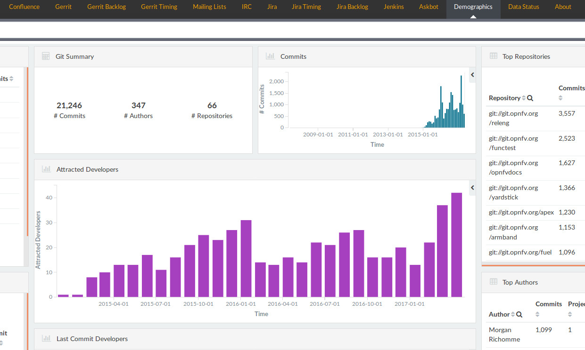

# Frequently Asked Metrics (FAM)

Welcome to our FAM! The goal of this document is to show you
how to retrieve the usual metrics asked by community managers
and other roles in open and inner source projects.

If you feel your specific metric should be available, please
feel free to add your own pull request or open a bug report
in this project.

The following is a list of the current FAMs available in this
document:

**Activity metrics and KPIs**
* [How can I have a list of the most active repositories?](#the-most-active-repositories)
* [How can I have a summary of the last 7 days of activity?](#last-seven-days-of-activity)

**Community metrics and KPIs**
* [How can I retrieve the attraction of new developers to my community?](#attraction-of-newcomers)
* [How can I have a list of the most active developers?](#the-most-active-developers)
* [How can I have a list of the most active organizations?](#the-most-active-organizations)

**Performance metrics and KPIs**
* [How can I measure my lag solving issues?](#lag-solving-issues)
  * [Open Issues KPI](#open-issues-kpi)
  * [Average Time Open for Issues KPI](#average-time-open-for-issues-kpi)
  * [Accumulated Lag for Open Issues KPI](#accumulated-lag-for-open-issues-kpi)

## Attraction of newcomers

This information is found in the 'Demographics' panel of the dashboard.

This image is calculated as aggregation of the developers doing their
first commit in a period of time.

In the image displayed above as an example, there are three main
areas of interest for this analysis. Those three areas are the
three peaks of attraction of developers.

We can see as example that those take place at the beginning of
2016, fall 2016 and early 2017.

What happened in this community during those months to have such
peaks of activity? There are usually different reasons for this,
although this goes from summits to programms such as the Google
Summer of Code or Outreachy activities.

## The most active developers

TBD

## The most active organizations

TBD

## The most active repositories

TBD

## Last seven days of activity

[This approach works for almost any panel and for any time selection.
There is a specific section for the last 7 days as this seems to be
a useful timeframe to have a look at. Others such as months or quarters
can be selected in the same way.]

The summary of the activity and community of a project is provided by the Overview panel.
This panel is usually the entry panel for any dashboard.

There are several ways of accessing the information for the last seven days, but this can
be reach by updating the timefilter at the top right corner of the dashboard. Once a new
timeframe of activity is selected, all of the widgets in the panel will be upated.

## Lag solving issues

This information is available in all of the panels with information
about the backlog. The widgets here referenced are basically calculated
in the same way independently of the data source. The total time that
a bug report or a changeset has been open is measured in days.

This information can be found in any panel with the 'Backlog' keyword
in its name.

The following image contains the generic information about the data
source. Then at the right side of the panel there are two charts
that display information over time.

The lag is calculated as the accumulated number of days that
each of the tickets, code review processes or any other activity
related to process has been opened. This is useful for tracking
old remaining issues still opened that either should be closed
or should be moved forward.

In this image there are three circles at the top chart and three
and the bottom chart. The first chart represents the number of
open issues over time. Each bar contains the total number of issues
opened in that period of time.

The second chart represents the accumulated time that those issues
have been opened and measured in days. The older an issue is, the
longer that bar is. In other words: the more at the left an issue
is found, the higher the number of days this has been opened.

Having a look at the three circles in each chart, the chart at the
top displays three peaks of remaining open issues. As there is a direct
relation between the activity on the top chart and on the bottom chart,
the second chart displays the accumulated 'lag' in days for
the issues still open.

Detecting those peaks of accumulated time at the bottom chart helps
to understand where part of the development bottlenecks are found.

## Process KPIs

This aims at providing a view of the available KPIs in the
several performance panels related to the software development
process.

### Open issues KPI

This KPI contains the number of issues open at the moment of analysis.
This is useful to count remaining open issues in the system. This works
in any data source that analyzes process. All of the panels with the
keyword 'backlog' has this value. The higher this value is, the higher
the number of remaining issues waiting to be closed.

### Average time open for issues KPI

This KPI counts the average time that the issues have been open for those
still open at the moment of the analysis. This works
in any data source that analyzes process. All of the panels with the
keyword 'backlog' has this value. The higher this value is, the higher
the time it is taking to close issues or any other process such as
code review processes.

### Accumulated lag for open issues KPI

This KPI counts the accumulated time of all of the open issues
at the moment of the analysis. This works
in any data source that analyzes process. All of the panels with the
keyword 'backlog' has this value. The higher this value is, the higher
the accumulated time or lag is and the worse.

